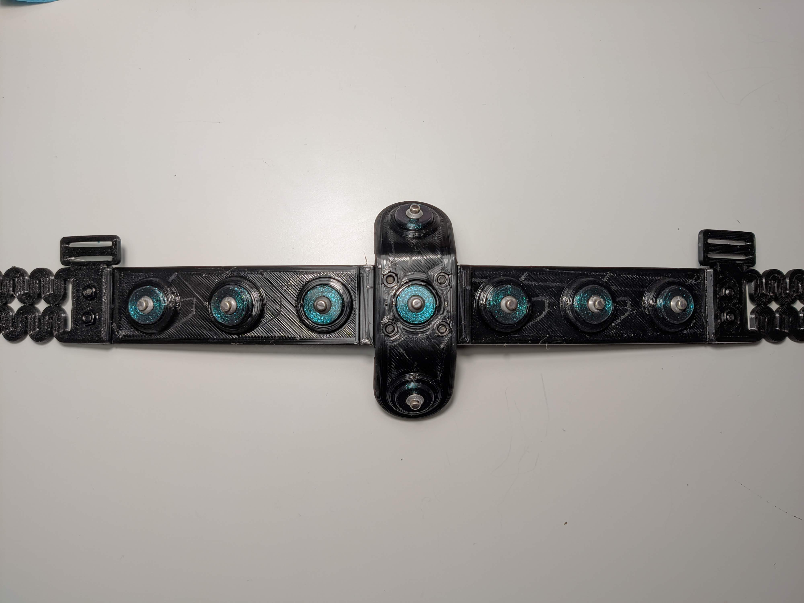
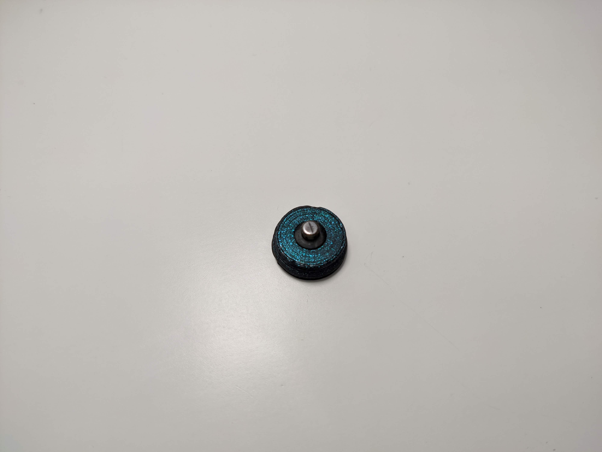
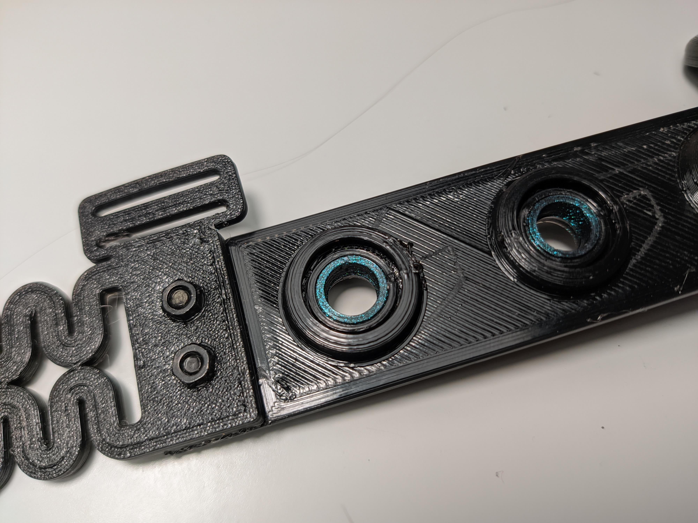
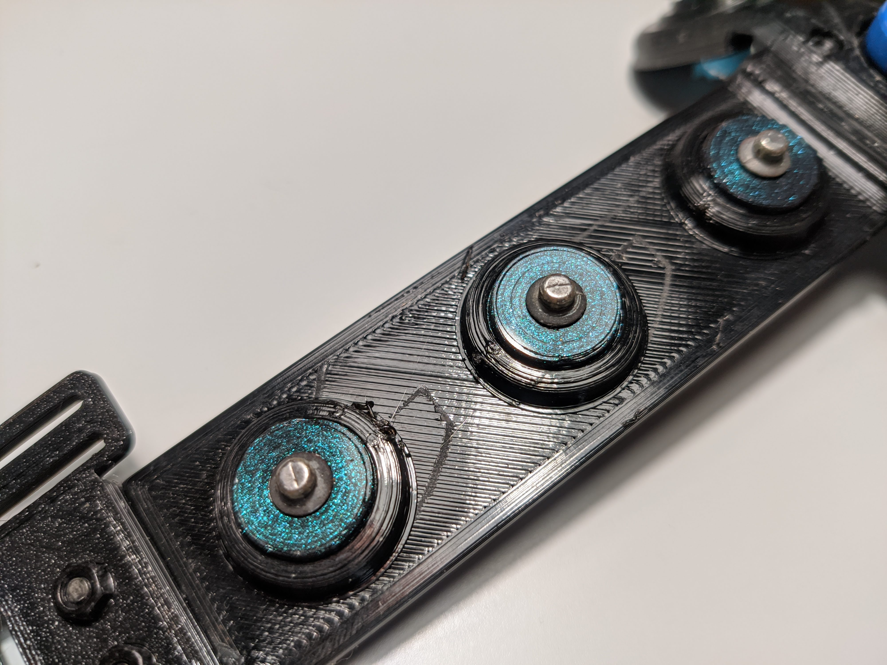

# MindAffect Snap Electrodes Headband

Here you find the `.stl` print files and instructions on how to assemble the snap-electrodes low-cost EEG headband developed by MindAffect B.V.

# Components Required

To make this headband you will need:

 1. The main electrode holding piece.  This should be 3d-printed using a rubber-like flexible material following this [stl file](main.stl)

 
 
 2. The electrode cross-piece.  As well as holding 6 electrodes in the horizontal headband, our design allows for 2 vertically displaced electrodes around `Oz`.   These are held by the vertical piece.  This should be printed using a relatively flexible material following the stl file [vertical Piece](verticalPiece.stl)
 3. 8 sponge-tubes.  Our design uses water-soaked sponges to bridge the connection between the electrode-pellet and the scalp.  The sponges are held in the sponge tube.  You should print 8 of these with hard or flexible material using the [sponge-tube](sponge-tube.stl)

 

 4. 8 electrode pellet holder.  To hold the electrode pellets in place the pellet holder clips in from the back of the headband.  You should print 8 of these with hard material using the [nib-disc](nib-disc.stl)
  

 4. 8 3mm x 8mm screws + bolts.  To hold the vertical piece and the expandable side pieces you will need 8 small bolts+screws.
 5. Left spring piece.  The headband must stretch to fit different head-sizes.  This with the spring pieces.  You should print with rubber-like flexible material the [sprint-left](spring-left.stl)
 6. Right spring piece.  The headband must stretch to fit different head-sizes.  This with the spring pieces.  You should print with rubber-like flexible material the [sprint-right](spring-right.stl)
 7. Forehead strap.  The forehead strap goes over the forehead between the 2 spring pieces.  This should be a strap of approx 20mm x 300mm and ~1mm thick.  If using the spring-pieces it does not *need* to be elasticated, though that may be more comfortable.
 8. (Option)  Instead of using the left/right spring pieces, 
 9. 8 Electrode-Pellets.  These sliver/sliver-chloride pellets provide the connection between the snap-connector wire and the water sponge.  For this design we have used the *Thought Technology SA9329*  pellets for ECG.  These can be ordered from [biomedical.com](https://bio-medical.com/ekgecg-pellets-for-sa9329.html)
 10. 8 Snap-electrode wires:  The electrode pellets easily damaged and need to be replaced.  So use the snap connector to connect to your amplifier.  Many possible snap cables are available, for example from here [din ecg cable snap]<https://www.google.com/search?q=Din+Holter+Ecg-kabel+10>.   Alternatively, you may just order the snap-connectors such as [ecg cable snap end](https://www.google.com/search?q=ecg+cable+snap+end) and make up the cables yourself.
 11. Electrode-wire to amplifier connector.  Depending on your amplifier and snap-connectors used, you may need a final connector between the cable and the amplifier.  For example to connect DIN ends to jumper ends on an openBCI amplifier.    When using the openBCI we have instead made up a cable end for direction connection with a 12x2 jumper header cable connector such as [12 x 2 header connector cable] (https://www.google.com/search?q=Jumper-12-x-2-header-cable-connector).
 12. 10 sponges to fit the sponge hold.  The sponges should be approximately, cylinders approximately 6mm x 10mm.  These can be made by slicing [dental cotten roll](https://www.google.com/search?q=dental+cotten+rol) to length, or by cutting a disposable cloth sponge into 10mm x 50 mm strips and simply rolling it up.

# 3d Print Instructions

As the headset should conform to a persons head, we recommend semi-flexible print materials, for the main electrode holding piece and the left/right spring pieces.  Stiff material like PLA, PETG or ABS is too rigid and won't work.  We have used "Ninja-flex" Flexible Filament but any rubber-like semi-flexible material should work.

The other pieces (sponge-tube, nib-disc) can be printed with stiff materials.

If using a home printer, we have used the following settings -- thought the best settings will depend on your particular printer.
  * Nozzle: 0.4mm
  * Extrusion width: .05mm
  * Layerheight: 0.25mm
  * Brim: 3mm
  * Speed: 20mm/s
  * Infill: 40% (Though this value should be adjusted for the flexibility of your material, use a higher value for more flexible materials.)
  * Perimeters: 5
  * Bottom layers: 5
  * Top layers: 5

# Assembly Instructions:

   1. On the *bottom side* (flat size) of the main piece insert the sponge holders into the electrode holes.  Note: this may take a little force.

  
   
   
   2. Insert the electrode pellet into the electrode pellet holder. 

   

   2. From the *top side* (raised bumps) of the main piece insert the electrode-pellet + holder into the electrode holes, this should "click" into place to firmly hold the pellet whilst leaving the snap connector should be visible on the back-side of the electrode hole.

 
      
   3. Attach the left/right spring pieces with 4 bolts+screws
   4. Loop the Forehead strap through the loops at the ends of the left/right spring pieces
   5. (If used) attach the insert the sponge-holder, electrode-pellets, and electrode-pellet-holders in the vertical piece as for the main-piece, and then attached the vertical piece to the main piece with 4 screws.
   6. (If needed) strip the snap-electrode wires and attach to the jumper header block.
 
 
   
   
   7. Snap the electrode wires onto the snap-connector on the electrode pellet.
 

# Usage Instructions

To use the assembled headset.
   1. Insert the sponges into the sponge holders
   2. With a plastic syringe dampen the sponges until they are saturated with water
   3. Shake off any excess water
   4. Put the headband on the head -- ideally starting by placing the electrodes on the hair and then sliding down over the forehead
   5. Adjust the forehead strap to a comfortable tightness.  Note: tighter tends to result in a better connection, *but* too tight will get painful rapidly.
   6. If signal quality is poor, and/or the subject does not feel water at the electrode locations, gently press each electrode in turn into the head to release some water from the sponge and complete the electrode connection.     

# Support

If you run into issues, either raise  an issue directly on github.

